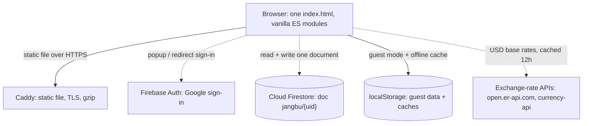

# Jangbu

A personal ledger that fits a day of income and spending onto one calendar. Jangbu (the Korean word for an account book) tints each calendar day by its net amount, expands recurring items like salary and subscriptions on the fly, and converts four currencies to a single base for monthly, quarterly, and yearly analysis. The whole thing is one HTML file that runs in the browser, with optional Google sign-in for cloud sync.

**Live: https://jangbu.clayborne.dev** (works without an account; guest mode keeps everything on your device).

The part I like most: recurring items are never written as data. A salary or a subscription is stored once as a rule (frequency, day, optional start and end), and every calendar cell, day sheet, and analysis total is produced by expanding those rules over the visible date range at render time. Editing one rule updates every past and future occurrence at once, and the saved document stays small no matter how many months you scroll.

<!-- SCREENSHOT / DEMO GIF GOES HERE -->
> **Demo placeholder:** add a screenshot of the tinted month calendar (light + dark) and a short GIF of adding an entry and opening the day sheet.

## Architecture

There is no application server. Caddy serves one static file, and the browser talks to Firebase and the exchange-rate APIs directly.



Firebase loads on demand through dynamic `import()` from gstatic, so first paint and guest mode never wait on it, and a failed load drops to guest mode instead of a blank page. The app reuses the sibling `haru` app's Firebase project (`haru-221ae`) and keeps its own Firestore collection, `jangbu`.

## Key technical decisions and tradeoffs

- **Recurring items are computed, not stored.** A rule holds a frequency (`monthly` by day-of-month, `weekly` by day-of-week, `yearly` by month and day) plus optional start and end dates. `ruleHitsDate` decides whether a rule fires on a date, `entriesForDate` merges real transactions with rule occurrences for a day, and `aggregate` sums a date range by walking day by day and expanding rules as it goes. Month-end is handled by clamping (day 31 falls on Feb 28 or 29). The tradeoff is that each render recomputes occurrences over its range rather than caching them, which is cheap at personal scale.

- **One state shape, two storage backends.** The entire ledger is a single object: `{ nick, created, tx[], recurring[], cats }`. Guest mode writes it to `localStorage` synchronously; cloud mode writes the same object to one Firestore document. `normalize()` runs on every load, so a document from either source, or a hand-edited backup file, is coerced to a safe schema (bad rows dropped, currencies checked, day and month values clamped) before the UI touches it.

- **Cache-first cloud load with a timeout.** On sign-in the app reads the Firestore document from the offline cache first and enters the app immediately if it is there, then reaches the network with a 6 second timeout (20 seconds if it already showed cached data) and reconciles. If the network never answers, it keeps the cached copy or seeds a fresh one from existing guest data, so signing in adopts your device data instead of wiping it. `persistentLocalCache` and `experimentalForceLongPolling` make this hold up on flaky connections.

- **Debounced writes, flushed on hide.** `save()` coalesces cloud writes into one `setDoc(..., { merge: true })` after 2 seconds. A failed write re-marks the state dirty so the next flush retries. Both `visibilitychange` (tab hidden) and `pagehide` force a flush, so closing the tab does not drop the last edit.

- **KRW-based multi-currency with cross rates.** Every amount carries its own currency (KRW, USD, AUD, PHP) and is converted to KRW for all totals and charts. Rates come from open.er-api.com on a USD base, with a jsdelivr currency-api fallback; AUD and PHP are derived from the USD cross rates. The table is cached in `localStorage` for 12 hours, and if both APIs fail the app uses fixed approximations rather than showing nothing. Foreign entries show a live "converted to KRW" preview while you type.

- **Liquid glass theming in plain CSS.** The look is CSS custom properties plus `backdrop-filter` blur, with a full light and dark palette swapped by a `data-theme` attribute on `<html>`. An inline script in `<head>` applies the saved theme before first paint to avoid a flash. The accent is a single emerald token, `#059669`.

- **No build step, no framework, no bundler.** One `index.html`, about 1,360 lines of inline markup, CSS, and ES-module JavaScript. Rendering is imperative: each view reads `state` and rewrites its `innerHTML`. Firebase is the only third-party dependency.

## Features

- **Calendar.** A month grid where each day cell shows its net amount, abbreviated for large values (`1.2K` and `3.4M` in English, with the Korean ten-thousand and hundred-million units otherwise), over a background tinted green for a positive net or red for a negative one, with intensity scaled to the month's largest net. A day with a recurring occurrence gets a marker. The month's income, expense, and net sit below.
- **Day sheet.** Tapping a date slides up a sheet listing that day's real transactions and rule occurrences with income, expense, and net totals. Add, edit, and delete happen there; a rule occurrence opens its rule editor.
- **Quick add.** A floating button on the calendar adds a transaction dated today.
- **Fixed items.** A tab for recurring income and expenses, with a projection of what is scheduled for the current month.
- **Analysis.** Month, quarter, and year views with a net trend chart (per day for a month, per month otherwise) and category share bars for both expense and income.
- **Settings.** Profile, language and theme toggles, exchange-rate table with a manual refresh, JSON backup export, reset, and sign-in or sign-out.

## Data model

Everything lives in one `state` object. `freshState()` seeds it and `normalize()` enforces the schema on load.

| Field | Shape | Notes |
|---|---|---|
| `nick` | string | Display name; set from the Google profile on sign-in, else a default |
| `created` | `YYYY-MM-DD` | Creation date |
| `tx[]` | transactions | `{ id, date, type: in\|out, cur, amount, cat, memo }` |
| `recurring[]` | rules | adds `freq`, `dom` (1-31), `dow` (0-6), `mon` (1-12), `start`, `end` |
| `cats` | `{ in[], out[] }` | 10 default expense and 5 default income categories, plus any the user adds |

Amounts are integers for KRW and two decimals for foreign currencies (`normAmt`). Ids are `Date.now()` in base 36 plus a short random suffix. Default expense categories are Food, Cafe/Snack, Transport, Shopping, Living, Health, Leisure, Subscription, Savings, and Other; income categories are Salary, Allowance, Side income, Interest, and Other. A custom category is appended to `state.cats[type]` with a generic tag emoji.

## Storage and sync

Two modes, tracked by `jangbu-mode`.

**Cloud (Firestore).** One document per user at `jangbu/{uid}`, holding the whole `state`. Google sign-in uses `GoogleAuthProvider` with a popup first and a redirect fallback when the popup is blocked. The `AIza...` value in the source is a public web config identifier, not a secret; access is enforced by Firestore rules:

```
match /jangbu/{uid} {
  allow read, write: if request.auth != null && request.auth.uid == uid;
}
```

Until those rules exist, cloud writes fail, so the sign-in screen shows a notice suggesting guest mode.

**Guest (localStorage).** Without signing in, all data stays in the browser.

| Key | Purpose |
|---|---|
| `jangbu-guest` | The whole `state` in guest mode |
| `jangbu-mode` | Last mode, `guest` or `cloud`, restored on return |
| `jangbu-theme` | Theme, read by the `<head>` script before paint |
| `jangbu-lang` | Language, `ko` or `en` |
| `jangbu-rates` | Exchange-rate cache with a timestamp |

Settings offers an export that downloads the current `state` as `jangbu-backup-YYYY-MM-DD.json`.

## Tech stack

**Frontend:** plain HTML, CSS, and JavaScript as ES modules. No framework, no bundler, no `package.json`. Styling is inline CSS custom properties using `color-mix()` and `env(safe-area-inset-*)`, a system font stack, and emoji plus an inline SVG data-URI favicon. Korean and English translations live in a single table, with the default picked from the browser language and locale-aware number and currency formatting.

**Backend services:** Firebase App, Auth, and Firestore at version 12.14.0 (pinned by the `FB_VER` constant), loaded from gstatic by dynamic import. Exchange rates from open.er-api.com with a jsdelivr currency-api fallback, both keyless.

**Hosting:** served as a static file by the shared Caddy instance on the clayborne.dev EC2 host, behind TLS from Let's Encrypt with gzip. There is no build, so deploying is a `git pull`.

## Running locally

No build or `package.json`, so any static server works. Because of the ES-module imports, serve over HTTP rather than opening the file directly.

```bash
python -m http.server 8000
# open http://localhost:8000

# or, with Node
npx serve .
```

Google sign-in only works on domains authorized in the Firebase console. If it is blocked locally, everything else still runs in guest mode.

## Notes and limitations

- **No automated tests.** The recurring-rule expansion (`ruleHitsDate`, `aggregate`) and the currency conversion are the parts most worth covering first.
- **The whole ledger is one Firestore document.** That is fine for personal use and keeps reads and writes to a single round trip, but a very large history would eventually want splitting.
- **Rates depend on two public APIs.** Offline or on a double failure, the app falls back to a cached table or fixed approximations, which drift over time.
- **Sign-in needs an authorized domain.** New domains must be added under Firebase authentication before Google login works there.
- **The favicon is still the old violet mark** while the UI accent moved to emerald. Cosmetic, and worth a one-line fix.
